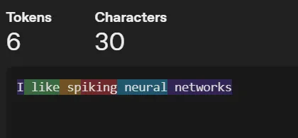

# AI in Healthcare

## Course description

Welcome to the course **AI in Healthcare**! The aim of this course is to develop digital competence of using AI at work in general, and its possible applications to healthcare. At the end of this course you should be able to give an informed judgement on proposed AI-based systems at work, discuss new applications of AI with their benefits and drawbacks.

Learning outcomes:

* You understand modern AI landscape, what happens when someone sends a message to an AI-powered tool, and know major AI players.
* You know AI concepts like deployment, context, agents, tools, MCP protocol, and guardrais.
* You know about privacy and ethics regulations for AI in Europe
* You have some ideas about benefits that AI could bring to patients, and who are most likely to adopt it first

The course is organized in four parts starting with a short introduction video, followed by reading material and a quiz.

1. A brief introduction to AI
2. AI Lifecycle: What happens when I send a message?
3. Privacy, Ethics, and other creative ways to "shoot yourself in a foot"
4. AI, Internet and digital literacy in healthcare

## 1. Introduction to AI

### What is AI?

I studied ML, and it works with numbers. Because numbers is the only thing a computer can work with. The classic ML task is recognizing a species of an Iris flower. One botanist long ago went hiking in the mountains and measured wild Iris flowers of different species, writing down the sizes of different parts of their flower in centimeters. Using these numbers, we can make a computer recognize an Iris flower species based purely on math. Multiply the numbers, add the together, divide by something, maybe compare to each other or a third number. Get a number out for each species of iris, the largest one tells what our guess should be.

This worked great for everything.. except the text. And the text is the most important part of our lives. This is how we share information with each other, and this is also how we think coming up with new information. “What’s the problem?” You may say, “Just give a number to each word, like they go in dictionary”. Say we take words “apple”, “aunt”, “airplane” and give them numbers “apple: 1, aunt: 2, airplane: 3”. Computer works with math, so immediately it will tell us that “aunt = 2*apple" and “airplane - apple = aunt”. We tried other ways of giving numbers to words, but they alone were not enough for a talking machine.

### Attention

The idea that worked was to put numbers between pairs of words, not on the words themselves! These numbers show how likely it is to see two words together in a text. For example (red, apple) = 0.5 and (red, aunt) = 0.002. We don’t know how what number is each word, but we know their relationship. The final piece of the puzzle is called “attention”, and “attention” looks for the most relevant “previous” word in the whole text instead of simply taking a word that was typed before. For example, seeing a word “bank” the attention will look for words like “river” and “loan” in the text to refine the meaning. 

The algorithm is very very computationally intensive. To generate the next word from a current one, first it has to look through all the previous text to find most relevant words with attention (or “attentions” as good models have, for example, 172 “attention heads” encoding different types of relations). Then the model goes through all known words building the pairs (last word + attention, candidate 1), (last word + attention, candidate 2)… It calculates the probabilities of these pairs, and selects among candidates with a high probability. The whole process repeats for each new generated word.

### Context: a short-term memory

Interestingly absent here is any kind of memory. The model “learns” stuff from its training data, but remembers absolutely nothing from conversations with the user. The model’s apparent “smartness” is based purely on scanning the history of conversation in the attention mechanism. But even worse, the attention scan is expensive so software will drop the conversation history beyond a number of words. Then the model forgets about those events instantly and completely, like a person suffering short-term memory loss. This can happen even in the middle of the model’s response! More expensive models running on large and costly GPUs can keep and process longer conversation history, but the quality of attention drops as text size grows. Try finding the most relevant word in a whole book.

The body of text that goes into the model is called "context. The model "remembers" things from its "context". Context length is measured in "tokens". A token is a simple English word, a part of a complex word, or a symbol. 

Context length is limited, can be very short on small local models like 4000 tokens (~3000 words). Expensive models offer 200,000 or even a 1,000,000 tokens context that can fit a whole book or a code base, but attention works worse on huge texts and it is very expensive to run (context lenght counts into pricing). This limited length context is also called a "context window".

Once the chat history gets longer than the context window, LLM algorithm no longer includes older parts of the text in its computations. The model completely forgets what was written in this text, like it never existed! Some software packages offer "context compression" that uses a different LLM to write a short summary of the chat history to avoid losing the information completely. 

### Context usage

We want the model to remember the important things from our previous conversation, or understand what we are talking about on a high level. People simulate model “memory” by adding relevant documents to model context before the conversation starts. This is nothing more than copy-pasting the document text to the chat :D  The model then "remembers" these documents and can have a meaningful discussion about them. Typical documents are project documentation, plans and schedules, programming code for software projects. Separate documents can give instructions to LLM, often very detailed. Writing LLM instructions to a document makes it easy to get a specific assistant you need by attaching the instructions document to the chat.

The art of jamming all necessary information the model needs for a good response in the limited context windows is called “context engineering”.

### RAG: the text database

RAG is a fancy word for "database search", when our database stores paragraphs of text and the search run on text similarity metric. It returns most relevant pieces of text that may contain an answer or information the model needs. RAG avoids copy-pasting huge documents to context as a whole, connecting huge collections of text to models with smaller context windown. But it has a "chance" of finding relevant information, that depends on exact text formulation.

### Long-term memory

Long-term memory is a text document with information that a model should remember. It is attached to the chat next time a user interacts with the model, and enables model to "recall" something from the previous conversation. This is no more than a text doc that you can write yourself, or ask a model to "remember" something then the model will write it down to the document.

Large "memory" storage can use RAG for unlimited capacity, but a chance of "recalling" relevant information.

### Tools and MCP

You can do simple math in your head, but take a calculator to compute tax percentage of a large puchase. Model also benefit by having "calculator" and other tools that compute answer in regular programming code. New AI models are trained to understand what is a "tool" (a function written in regular code), how to use it, and most important how to decide when to use the tool.

It is very easy to write tools for a smart model trained in tool use: literally write a function and register it to the model using the model software. The model handles all the rest, including decision when to use your tool. It can even read comments from the code!

Sometimes model want to do something at your computer, like add a calendar event or read latest emails. This can be done with a tool running on your computer, and is easy to do for a small AI model also running on your computer like Siri. But how can you do it for a big model running somewhere far away in a data center, that has no way of connecting to your computer directly (we closed all these ways to stop computer viruses)? 

The answer is a language that lets model talk to a tool running somewhere else. This language is called MCP: Model Context Protocol (protocol ~ communication language). MCP is like a USB plug letting you connect different tools/devices to a model. MCP is also universal and interchangeable between the models. But you also need to be careful with it, just like you should not be connecting a USB stick found somewhere to your work machine.

### Guardrails

Model is a computer program. It has no idea about our cultural norms or society workings, and can generate inappropriate response from rude or swearing text to simply silly messages (A person asked DHL "What happens if I won't be home when you deliver the package?" and the model replied "We forgive you"; or a model trained on work chats and asked to perform a task replied "I'll do it tomorrow").

In business tasks, AI responses should be checked for appropriateness and usefullness before sending them back to customers. These checks are called "guardrails". They can be done in many ways, some with regular code and others with an another "arbiter" LLM.

